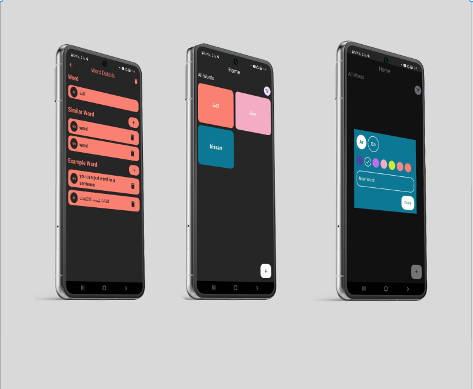

# 📱 Word App – Manage Vocabulary Simply and Efficiently

A bilingual (Arabic–English) vocabulary app built with **Flutter**, designed to help users store, manage, and sort word meanings in a clean and efficient way.

---

## 🚀 Features

* ✍️ **Add Words:** Store words with their meanings and usage examples.
* 🗑️ **Edit/Delete:** Update or remove entries with ease.
* 📊 **Sort by:**

  * ✅ Word length
  * ✅ Date added
  * ✅ Language
  * ✅ Ascending / Descending order
* 🗂️ **Local Storage:** Uses **Hive** (a fast, lightweight NoSQL database) for storing data offline.
* ⚙️ **State Management:** Powered by **Cubit** from the BLoC package.

---

## 🛠️ Tech Stack

* **Flutter** – Cross-platform UI framework
* **Hive** – Local NoSQL database
* **Cubit** – State management (lightweight BLoC variant)

---

## 📸 Mockup

 <!-- Make sure the image is uploaded in your repo root -->

---

## 📎 LinkedIn Post

Check out the full announcement and feedback thread on LinkedIn:
🔗 [LinkedIn Post](https://www.linkedin.com/feed/update/urn:li:activity:7325829081625706496/)

---

## 💬 Feedback

Feel free to open an issue, suggest features, or contribute via pull requests.

Thanks for checking it out! 😊

---

## 📌 Tags

`#Flutter` `#Hive` `#Cubit` `#Bloc` `#NoSQL` `#MobileAppDevelopment` `#StateManagement` `#OpenSource` `#FlutterDev` `#ArabicFlutter` `#UIdesign`
